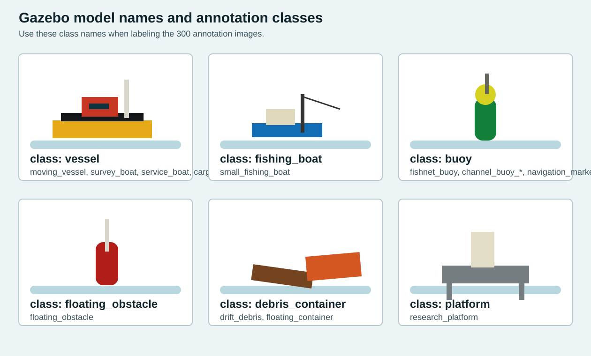

# USV Fog Simulation Project

面向琼州海峡大雾低能见度场景，本工程用 Gazebo Classic + ROS 2 Humble 构建无人船多模态感知仿真。目标是在能见度低于 500 m 的情况下，融合毫米波雷达、声呐、门控相机、无人机远程观测和 AIS，实现海上目标识别、动态跟踪、避障跟随和实验指标评估。

原始 `usv_ws` 备份保留在：

```text
/home/hu/usv_ws_original_backup_20260523_c3_merge
```

## 环境要求

- Ubuntu 22.04
- ROS 2 Humble
- Gazebo Classic 11
- ONNX Runtime C++，默认路径 `/home/hu/onnxruntime-linux-x64-1.23.2`

安装 ROS/Gazebo 依赖：

```bash
sudo apt update
sudo apt install \
  ros-humble-gazebo-ros-pkgs \
  ros-humble-xacro \
  ros-humble-robot-state-publisher \
  ros-humble-rviz2
```

如果没有 ONNX Runtime：

```bash
cd ~
wget https://github.com/microsoft/onnxruntime/releases/download/v1.23.2/onnxruntime-linux-x64-1.23.2.tgz
tar -xzf onnxruntime-linux-x64-1.23.2.tgz
```

ONNX Runtime 放在其他目录时：

```bash
colcon build --symlink-install --cmake-args -DONNXRUNTIME_ROOT=/path/to/onnxruntime-linux-x64-1.23.2
```

## 编译

推荐用干净环境脚本编译，避免旧 overlay 残留路径造成 `AMENT_PREFIX_PATH`、`CMAKE_PREFIX_PATH` 警告：

```bash
cd ~/usv_ws
./scripts/build_clean_env.sh
source install/setup.bash
```

如果你手动删除过 `install/`、`build/`、`log/`，但当前终端之前 source 过旧的 `install/setup.bash`，直接执行 `colcon build` 可能出现类似：

```text
The path '/home/hu/usv_ws/install/usv_bringup' in the environment variable AMENT_PREFIX_PATH doesn't exist
```

这不是源码错误，是当前 shell 环境里还挂着已删除的安装路径。解决方法是开一个新终端，或用上面的 `scripts/build_clean_env.sh`。

`lidar_robot/src/lidar_depth_node.cpp` 里 signed/unsigned 比较警告已经修掉，当前干净编译结果应为 5 个包通过且无 `lidar_robot` 编译警告。

## 启动仿真

普通启动：

```bash
source install/setup.bash
ros2 launch usv_bringup sim.launch.py
```

如果遇到 Gazebo Transport multicast 的：

```text
Exception sending a multicast message: No such device
Exception sending a multicast message: 没有那个设备
```

通常是 Gazebo 想对不存在或已断开的网卡发组播发现包。仿真本身一般还能跑。推荐用 localhost 脚本固定 Gazebo 通信地址：

```bash
./scripts/launch_sim_localhost.sh gui:=false rviz:=true
```

常用启动开关：

```bash
ros2 launch usv_bringup sim.launch.py gui:=false rviz:=true
ros2 launch usv_bringup sim.launch.py usv_follow:=false
ros2 launch usv_bringup sim.launch.py uav:=false
ros2 launch usv_bringup sim.launch.py c3_mmwave:=false
ros2 launch usv_bringup sim.launch.py rgbd_dehaze:=false
ros2 launch usv_bringup sim.launch.py ais:=false
ros2 launch usv_bringup sim.launch.py evaluation:=false
ros2 launch usv_bringup sim.launch.py target_model:=small_fishing_boat
```

`target_model` 用来切换主跟踪目标，同时会影响动态目标高亮和无人机远程搜索目标。常用模型名：

```text
moving_vessel
small_fishing_boat
survey_boat
service_boat
```

## 当前任务链路

1. `ocean_fog.world` 生成大雾海峡、水面、船舶、渔船、浮标、漂浮物、平台、集装箱和无人机。
2. `dynamic_target_controller` 让多个目标沿航路点低速移动，默认主跟踪目标是 `moving_vessel`，不是固定转圈。
3. 船上传感器发布毫米波雷达、声呐、深度相机、门控相机、ALS 点云；无人机发布机载门控相机和 ALS 点云。
4. `gated_camera_recognizer` 用 RGB + Depth 做近/中/远门控切片，再用 ONNX Runtime 跑 YOLO，输出图像框、检测数组和 `PointCloud2` 目标点。
5. `ais_simulator` 从 Gazebo 真值生成 `/ais/targets`，含 MMSI、相对位置、速度、SOG、COG、heading、类别和置信度。
6. `radar_sonar_tracker` 融合毫米波雷达、声呐、船载门控目标点、无人机门控目标点和 AIS，输出稳定 track。
7. `uav_patrol_controller` 默认飞到 `moving_vessel` 附近巡查，并把远程目标指引发布到 `/uav/remote_target_status`，给本船提供“远处先发现、指挥船追踪”的辅助。
8. `usv_target_follower` 锁定船类目标，使用目标速度做短时前视预测，并根据前方障碍物偏航、减速或停车。
9. `tracking_evaluator` 对比 Gazebo 真值和融合 track，发布误检率、漏检率、CPA、TCPA、最小距离和 ID 切换次数。

## 主要话题

- 毫米波雷达：`/mmwave_radar/scan`
- 窄束声呐：`/sonar/scan`
- 船载门控图像：`/gated_camera/image_raw`
- 船载门控识别图：`/gated_camera/annotated`
- 船载门控目标点：`/gated_camera/detection_points`
- 无人机门控图像：`/uav/gated_camera/image_raw`
- 无人机门控目标点：`/uav/gated_camera/detection_points`
- 无人机远程目标：`/uav/remote_target_status`
- AIS 仿真：`/ais/targets`
- 融合跟踪 Marker：`/tracked_objects`
- 融合跟踪 PoseArray：`/tracked_object_poses`
- 融合跟踪文字状态：`/tracked_objects_text`
- 本船跟随状态：`/usv_follow_status`
- 实验评估指标：`/tracking_metrics`
- 动态目标 Marker：`/simulated_targets`
- 波浪浮力状态：`/wave_buoyancy/status`

查看关键状态：

```bash
ros2 topic echo /tracked_objects_text
ros2 topic echo /uav/remote_target_status
ros2 topic echo /ais/targets
ros2 topic echo /usv_follow_status
ros2 topic echo /tracking_metrics
```

## ONNX 数据集和类别

船载门控相机和无人机门控相机建议先共用同一个 ONNX 数据集和同一个模型，不需要单独训练两套。原因是两者识别的目标类别相同，分开训练会增加标注量和维护成本。正确做法是把船载低视角、无人机高视角、远近不同距离、大雾/弱雾/清晰场景都放进同一个训练集，让模型学到视角变化。

只有在后续发现两个视角差异很大，比如无人机俯视小目标明显优于船载平视，且共用模型效果下降时，再考虑分模型。

当前六类标注建议顺序：

```yaml
class_names: [vessel, fishing_boat, buoy, floating_obstacle, debris_container, platform]
```

对应关系：

| 标注类别 | Gazebo 模型名 |
| --- | --- |
| `vessel` | `moving_vessel`, `survey_boat`, `service_boat`, `cargo_ship_far`, `anchored_tanker` |
| `fishing_boat` | `small_fishing_boat` |
| `buoy` | `fishnet_buoy`, `channel_buoy_north`, `channel_buoy_south`, `navigation_marker_port`, `navigation_marker_starboard`,`net_line_a` |
| `floating_obstacle` | `floating_obstacle` |
| `debris_container` | `drift_debris`, `floating_container` |
| `platform` | `research_platform` |

指示图：



注意：如果继续使用旧的 2 类 `best.onnx`，而配置文件已经写成六类，类别文字可能不准确。论文实验要用六类指标时，需要用上面的六类重新标注、训练并导出新的 `best.onnx`。

## 标注图片采集

为了避免船载视角拍不到远处或侧后方模型，已新增专门标注环境：

- world：`src/usv_bringup/worlds/annotation_targets.world`
- launch：`src/usv_bringup/launch/annotation_capture.launch.py`
- 脚本：`scripts/capture_annotation_dataset.sh`

重新生成角度覆盖图片：

```bash
cd ~/usv_ws
./scripts/build_clean_env.sh
./scripts/capture_annotation_dataset.sh /home/hu/usv_captures/annotation_raw 96
```

当前已经生成：

```text
/home/hu/usv_captures/annotation_raw
```

数量：96 张 JPG，分辨率 512x384。

这个采集场景现在按“模型样本架”的思路采集：`moving_vessel`、`small_fishing_boat`、`survey_boat`、`service_boat`、`fishnet_buoy`、`floating_obstacle`、`drift_debris`、`floating_container`、`research_platform` 会分别按 8 个朝向旋转采样，后面再补少量多目标组合图。它不追求每张图都有所有模型，而是优先覆盖每个物体的正面、侧面、背面和斜角形态。旧图片如果不需要，可以直接重新运行脚本，脚本会删除并重建输出目录。

标注建议：

- 只标可见主体，不要把水面阴影和尾迹框进去。
- 浮标类包含普通浮标、航标、渔网浮标。
- `debris_container` 把漂浮木箱、漂浮集装箱统一到一类，后续数据多了再拆成 `debris` 和 `container`。
- 训练后导出 ONNX：

```bash
yolo export model=best.pt format=onnx imgsz=640 opset=12
```

替换默认模型：

```text
src/usv_bringup/models/best.onnx
```

重新编译并启动：

```bash
./scripts/build_clean_env.sh
source install/setup.bash
ros2 launch usv_bringup sim.launch.py
```

## 评估指标

`tracking_evaluator` 发布 `/tracking_metrics`，用于论文和实验报告。它把 Gazebo 真值模型转到本船 `base_link` 坐标，与 `/tracked_objects_text` 中的 track 最近邻匹配。

字段含义：

- `tp`：当前帧真目标被 track 匹配到的数量。
- `fn`：当前帧真目标没有匹配到 track 的数量，即漏检。
- `fp`：当前帧 track 没有靠近任何真值目标或障碍物的数量，即误检。
- `miss_rate`：当前帧漏检率，`fn / (tp + fn)`。
- `false_positive_rate`：当前帧误检率，`fp / (tp + fp)`。
- `total_miss_rate`：累计漏检率。
- `total_false_positive_rate`：累计误检率。
- `id_switches`：累计 ID 切换次数。目标曾经匹配 track A，后来匹配 track B，就记一次。
- `min_distance`：本船到最近目标/障碍物的当前距离。
- `min_cpa`：CPA，按当前相对速度预测的最近会遇距离。
- `min_tcpa`：TCPA，到达 CPA 的预计时间。
- `closest_model`：当前最近的真值模型名。

查看：

```bash
ros2 topic echo /tracking_metrics
```

主要参数在 `src/usv_bringup/config/perception.yaml` 的 `tracking_evaluator`：

```yaml
match_gate: 7.0
eval_range: 140.0
track_timeout: 2.5
cpa_horizon: 120.0
publish_rate: 2.0
```

调参建议：

- track 明明对上了但仍算漏检：增大 `match_gate`。
- 远处目标不进入评估：增大 `eval_range`。
- track 断断续续导致指标跳动：增大 `track_timeout`。
- 只关心短时碰撞风险：减小 `cpa_horizon`。

## AIS 融合

新增 `ais_simulator` 节点会把 Gazebo 中的船类目标发布成 `/ais/targets`：

```json
{
  "mmsi": 413000100,
  "name": "moving_vessel",
  "x": 35.2,
  "y": -4.1,
  "vx": 0.3,
  "vy": 0.1,
  "sog": 0.42,
  "cog": 0.33,
  "heading": 0.31,
  "confidence": 0.90,
  "class_id": 0,
  "last_source": "ais"
}
```

这里的 `x/y/vx/vy` 已经转到本船 `base_link` 坐标，`radar_sonar_tracker` 直接订阅 `/ais/targets` 并作为 `source=ais` 的检测源融合。

AIS 的作用：

- 低频但稳定，适合远距离目标保持和重新关联。
- 目标被雾、相机视野或雷达漏检影响时，AIS 能降低跟丢概率。
- AIS 带 MMSI 和航向，后续可以做目标身份保持，减少 ID 切换。

当前参数：

```yaml
ais_simulator:
  ros__parameters:
    output_topic: /ais/targets
    confidence: 0.90
    max_range: 240.0

radar_sonar_tracker:
  ros__parameters:
    ais_topic: /ais/targets
    ais_confidence: 0.88
    min_ais_confidence: 0.45
```

如果 AIS 融合效果不好，按这个顺序查：

1. `ros2 topic echo /ais/targets` 看是否有 `moving_vessel`。
2. `ros2 topic echo /tracked_objects_text` 看 track 的 `sources` 是否包含 `ais`。
3. AIS 有但不融合：增大 `radar_sonar_tracker.association_gate`。
4. AIS 抢占错误目标：降低 `ais_confidence`，或把 AIS 只用于 `target_model_names` 中真正需要跟踪的船。
5. 真实 AIS 接入时，需要把经纬度转换到 ENU/world，再按本船姿态转到 `base_link`，字段保持 `x/y/vx/vy/mmsi/sog/cog/heading`。

## 跟踪和避障如何工作

`radar_sonar_tracker` 当前是轻量融合跟踪器：

1. 雷达 `LaserScan` 聚类得到目标中心。
2. 声呐窄束扫描补充近距离正前方障碍。
3. 船载/无人机门控相机输出目标点云，带置信度和类别。
4. AIS 提供低频、稳定的船类目标点。
5. 对所有检测做最近邻关联，维护 track 的位置、速度、置信度、类别、命中次数和来源集合。

`usv_target_follower` 当前是目标跟随 + 反应式避障：

1. 优先选择船类目标，当前配置 `follow_class_ids: [0.0, 1.0]`，即 `vessel` 和 `fishing_boat`。
2. 如果无人机发布 `/uav/remote_target_status`，该远程目标会被强优先级锁定。
3. 控制器保留 `locked_target_id`，短时漏检时用 `vx/vy` 做预测，不会马上换目标。
4. 其他 track 和指定 Gazebo 障碍模型作为障碍物。
5. 障碍越靠近航线，偏航越大、速度越低；进入 `hard_stop_distance` 会停车。

当前避障还不是完整局部规划器。它适合演示和初步实验，但如果要做更真实的自动避碰，建议按下面“改进方向”升级。

## 后期调参入口

主要参数集中在：

```text
src/usv_bringup/config/perception.yaml
```

关键调参：

- 跟踪更快、更不容易丢：增大 `usv_target_follower.max_speed`、`speed_gain`、`target_timeout`、`target_lock_timeout`、`radar_sonar_tracker.association_gate`、`track_timeout`。
- 跟得太近：增大 `desired_standoff`。
- 转向太慢：增大 `max_yaw_rate`、`yaw_gain`。
- 绕障不明显：增大 `obstacle_clearance`、`avoidance_gain`、`obstacle_lookahead`。
- 太容易误停：减小 `hard_stop_distance` 或 `hard_stop_lateral`。
- 无人机远程指挥不明显：增大 `uav_patrol_controller.remote_target_confidence`，减小 `target_follow_backoff`，或确认 `target_tracking_enabled: true`。
- AIS 融合太弱：增大 `ais_confidence` 或 `association_gate`。
- AIS 抢错目标：降低 `ais_confidence`，缩小 `ais_simulator.target_model_names`。

切换目标：

```bash
ros2 launch usv_bringup sim.launch.py target_model:=small_fishing_boat
ros2 launch usv_bringup sim.launch.py target_model:=service_boat
```

如果目标一开始太远，本船相机/雷达找不到，先确认远程辅助是否工作：

```bash
ros2 topic echo /uav/remote_target_status
ros2 topic echo /ais/targets
```

只要这两个话题有目标，本船即使视觉暂时没看到，也能靠无人机/AIS 指引先往目标方向接近。仍然找不到时，按顺序处理：

- 确认 `target_model` 写的是 world 里真实存在的模型名。
- 增大 `usv_target_follower.max_follow_range` 和 `radar_sonar_tracker.max_tracking_range`。
- 增大 `ais_simulator.max_range`，让 AIS 更早给出目标。
- 减小 `uav_patrol_controller.target_follow_backoff`，让无人机飞得离目标更近。
- 在 `dynamic_target_controller.cpp` 里把该目标航路点的前几个点放近一点，用于演示启动阶段。

## 可以继续改进的方向和具体做法

### 1. 把反应式避障升级成局部路径规划

推荐路线一：DWA。

- 新增 `local_planner` 节点，订阅 `/tracked_objects_text`、`/usv_follow_status`、本船状态。
- 在速度空间采样 `(v, yaw_rate)`，向前模拟 3 到 6 秒轨迹。
- cost 包含目标距离、目标方位、障碍距离、CPA、速度平滑、转向幅度。
- 选 cost 最小的速度命令，再由 `usv_target_follower` 执行。
- 优点是实现成本低，适合当前 Gazebo `/set_entity_state` 控制方式。

推荐路线二：VO/ORCA。

- 对每个动态障碍计算相对速度障碍 cone。
- 选择不落入碰撞 cone 的速度。
- 适合多船会遇、横穿渔船、动态浮标漂移。

推荐路线三：Nav2 costmap。

- 把 track 和点云投影成 `costmap_2d` 障碍层。
- 用 DWB/TEB/controller server 输出局部速度。
- 这更接近真实机器人系统，但需要给船建立 odom/map/base_link TF 链和运动学约束。

### 2. 给 tracker 加 Kalman/UKF/JPDA

当前 `radar_sonar_tracker` 是 alpha-beta 近似滤波 + 最近邻关联。升级方法：

- 每条 track 状态改为 `[x, y, vx, vy]`，维护协方差 `P`。
- 雷达/声呐/门控/AIS 分别设置测量噪声 `R`。
- 预测：`x = F x`，`P = F P F^T + Q`。
- 更新：按每个传感器测量矩阵 `H` 做 Kalman update。
- 多目标靠近时，用 Mahalanobis gate 替代普通欧氏距离。
- 目标交叉时，用 JPDA 或 Hungarian assignment，减少 ID switch。

### 3. 加强 AIS 融合

当前 AIS 已经进入程序，但还是轻量 JSON 仿真。进一步可以：

- 定义正式消息，例如 `usv_msgs/msg/AisTarget.msg` 和 `AisTargetArray.msg`。
- 加入 MMSI 到 track 的身份字段，不只按空间距离关联。
- AIS 延迟仿真：给时间戳加 1 到 5 秒延迟，测试融合鲁棒性。
- 经纬度转换：真实 AIS 先 WGS84 到 ENU，再转 `world/base_link`。
- 航向一致性：关联时同时比较位置、速度、COG/heading，减少错配。

### 4. 增加论文指标和 rosbag 场景集

当前已经有：

- 误检率
- 漏检率
- CPA
- TCPA
- 最小安全距离
- ID 切换次数

建议继续做场景集：

- 近距离浮标避障
- 横穿渔船
- 静止漂浮物
- 远处大船
- 无人机辅助观测
- 大雾低能见度
- AIS 延迟或错误 AIS

每个场景记录：

```bash
ros2 bag record \
  /tracked_objects_text \
  /tracking_metrics \
  /usv_follow_status \
  /uav/remote_target_status \
  /ais/targets \
  /gated_camera/annotated \
  /model_states
```

## 程序结构

```text
Readme.md
scripts/
  build_clean_env.sh                 干净环境编译，解决旧 overlay 路径警告
  launch_sim_localhost.sh            用 127.0.0.1 启动仿真，减少 Gazebo multicast 网卡报错
  capture_annotation_dataset.sh      删除旧标注输出并采集角度覆盖图片
docs/
  model_reference/class_reference.svg 六类目标指示图
src/usv_bringup/
  launch/sim.launch.py               主启动文件
  launch/annotation_capture.launch.py 专用标注采集启动文件
  worlds/ocean_fog.world             大雾海峡主场景
  worlds/annotation_targets.world     标注采集专用紧凑场景
  config/perception.yaml             感知、融合、控制、AIS、评估参数
  models/best.onnx                   默认 YOLO ONNX 模型
src/usv_description/
  urdf/wamv_base.urdf.xacro          船体、雷达、声呐、相机、ALS、多高度 C3 雷达
  rviz/default.rviz                  RViz 默认显示配置
src/usv_perception/
  src/gated_camera_recognizer.cpp    门控切片、ONNX 推理、检测点云发布
  src/radar_sonar_tracker.cpp        雷达/声呐/门控/无人机/AIS 融合跟踪
  src/ais_simulator.cpp              Gazebo 真值到 AIS JSON 仿真
  src/tracking_evaluator.cpp         误检、漏检、CPA、TCPA、ID switch 指标
  src/usv_target_follower.cpp        本船目标锁定、跟随、基础避障
  src/uav_patrol_controller.cpp      无人机巡查、远程目标指引
  src/dynamic_target_controller.cpp  多目标低速航路点运动
  src/wave_buoyancy_node.cpp         波浪浮力近似
  src/ros_image_recorder.cpp         ROS 图像话题保存为 JPG/PNG
src/lidar_robot/
  src/lidar_depth_node.cpp           点云/激光深度相关节点，已修复 signed/unsigned 警告
  scripts/mmwave_scan_converter.py   C3 多高度毫米波 raw scan 到检测点云
src/depth_image_to_pointcloud2/
  RGB-D 去雾和点云生成
```
