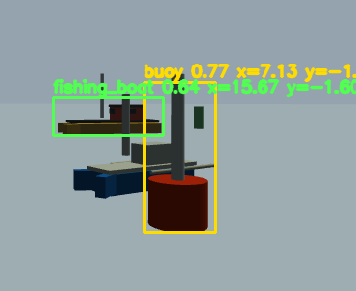

# USV Fog Simulation Project

## 环境要求

- Ubuntu 22.04
- ROS 2 Humble
- Gazebo Classic 11

## 安装依赖

```bash
sudo apt update
sudo apt install \
  ros-humble-gazebo-ros-pkgs \
  ros-humble-xacro \
  ros-humble-robot-state-publisher \
  ros-humble-rviz2
```

门控相机的 ONNX 推理使用 ONNX Runtime C++。如果机器上没有，请下载官方 Linux x64 包：

```bash
cd ~
wget https://github.com/microsoft/onnxruntime/releases/download/v1.23.2/onnxruntime-linux-x64-1.23.2.tgz
tar -xzf onnxruntime-linux-x64-1.23.2.tgz
```

默认工程会查找：

```text
/home/hu/onnxruntime-linux-x64-1.23.2
```

如果放在其他位置，编译时指定：

```bash
colcon build --symlink-install --cmake-args -DONNXRUNTIME_ROOT=/path/to/onnxruntime-linux-x64-1.23.2
```

## 编译

```bash
cd ~/usv_ws
colcon build --symlink-install
source install/setup.bash
```

## ONNX 识别

当前工程的门控识别节点是 C++，通过 ONNX Runtime 加载 YOLO ONNX 模型，不依赖 OpenCV DNN。默认模型放在 `src/usv_bringup/models/best.onnx`，会随 `usv_bringup` 一起安装。

仿真中的门控相机由两部分近似实现：

- `/gated_camera/image_raw`：Gazebo 普通 RGB 相机图像。
- `/depth_camera/depth/image_raw`：深度相机图像。

`gated_camera_recognizer` 用深度图把 RGB 图像按距离分成近/中/远门控切片，并生成 `/gated_camera/range_view`。这是真实门控相机的仿真近似，不是硬件层面真的由一台 RGB 相机和一台深度相机组成。

当前模型类别顺序见 `src/usv_bringup/config/perception.yaml`：

```yaml
class_names: [buoy, fishing_boat]
```

## 启动大雾海面仿真

```bash
ros2 launch usv_bringup sim.launch.py
```

无图形界面启动：

```bash
ros2 launch usv_bringup sim.launch.py gui:=false rviz:=false
```

如果 Gazebo 图形界面很卡，优先这样跑：只开 Gazebo 后端和 RViz。

```bash
ros2 launch usv_bringup sim.launch.py gui:=false rviz:=true
```

如果暂时不需要无人机远距离 ALS：

```bash
ros2 launch usv_bringup sim.launch.py uav:=false
```

## 主要话题

- 毫米波雷达：`/mmwave_radar/scan`
- 窄束声呐：`/sonar/scan`
- 深度相机彩色图：`/depth_camera/image_raw`
- 深度相机深度图：`/depth_camera/depth/image_raw`
- 深度相机点云：`/depth_camera/points`
- ALS 点云：`/als/points`
- 门控相机原始图：`/gated_camera/image_raw`
- 门控相机近距切片：`/gated_camera/slice_near`
- 门控相机中距切片：`/gated_camera/slice_mid`
- 门控相机远距切片：`/gated_camera/slice_far`
- 门控相机组合识别图：`/gated_camera/range_view`
- 门控相机标框图：`/gated_camera/annotated`
- 门控相机识别结果：`/gated_camera/detections`
- 门控相机目标点云：`/gated_camera/detection_points`
- 门控相机识别状态：`/gated_camera/status`
- 无人机远距离相机：`/uav/front_camera/image_raw`
- 无人机 ALS 点云：`/uav/als/points`
- 无人机远距离识别图：`/uav/long_range/range_view`
- 无人机远距离识别结果：`/uav/long_range/detections`
- 雷达声呐动态跟踪结果：`/tracked_objects`
- 跟踪文字状态：`/tracked_objects_text`
- 动态仿真目标标记：`/simulated_targets`
- 波浪浮力状态：`/wave_buoyancy/status`

## 查看识别结果

启动后查看标框图：

```bash
ros2 run rqt_image_view rqt_image_view /gated_camera/annotated
```

查看识别状态：

```bash
ros2 topic echo /gated_camera/status
```

状态中 `backend=onnxruntime_cpu` 表示正在使用 ONNX Runtime 推理；`max_score` 是当前帧最高模型置信度。

查看 2D 检测结果：

```bash
ros2 topic echo /gated_camera/detections
```

查看目标点云：

```bash
ros2 topic echo /gated_camera/detection_points
```

`/gated_camera/detection_points` 类型是 `sensor_msgs/PointCloud2`。这是给后续程序使用的单一目标结果话题：每个识别目标对应一个点，坐标系为 `base_link`，即以船为中心，同时携带 3D 坐标、检测框、置信度和类别 ID：

```text
x: 目标在船前方的距离，单位 m
y: 目标在船左/右方向的位置，单位 m
z: 目标高度，单位 m
intensity: 识别置信度
class_id: 类别编号，0=buoy，1=fishing_boat
bbox_cx: 检测框中心 x，单位 pixel
bbox_cy: 检测框中心 y，单位 pixel
bbox_w: 检测框宽度，单位 pixel
bbox_h: 检测框高度，单位 pixel
```

文字类别名在 `/gated_camera/detections` 和 `/gated_camera/status` 中查看。后续算法如果只需要数值结果，订阅 `/gated_camera/detection_points` 即可；RViz 中添加 `PointCloud2` 并选择该话题，可以看到目标点。

## 采集 ROS 相机话题图片

不要截 Gazebo GUI 窗口，直接保存 ROS 图像话题。

保存船载门控原始图，适合重新标注和训练：

```bash
source install/setup.bash
ros2 run usv_perception ros_image_recorder --ros-args \
  -p image_topic:=/gated_camera/image_raw \
  -p output_dir:=~/usv_captures/gated_raw \
  -p prefix:=gated_raw \
  -p every_n:=3 \
  -p max_images:=300
```

保存无人机远距离图：

```bash
ros2 run usv_perception ros_image_recorder --ros-args \
  -p image_topic:=/uav/long_range/range_view \
  -p output_dir:=~/usv_captures/uav \
  -p prefix:=uav \
  -p every_n:=3 \
  -p max_images:=300
```

这些图片可以作为后续重新训练或测试识别模型的数据源。

## 当前功能

- 大雾海峡环境：Gazebo world 中配置线性雾效、低对比度光照、海面和航标，目标外观已从方块代理加强为更像船、渔船、浮标和漂浮物的组合模型。
- 波浪和浮力近似：`wave_buoyancy_node` 对无人船施加周期性力/力矩，使船体产生海况扰动。
- 动态目标：`dynamic_target_controller` 通过 `/set_entity_state` 按轨迹直接移动小船、浮标和漂浮障碍物，生成可被相机、雷达和声呐观察到的运动目标。
- 动态跟踪：`radar_sonar_tracker` 从毫米波雷达和声呐扫描中聚类目标，并输出速度估计和 RViz Marker。
- 门控相机识别：`gated_camera_recognizer` 根据相机图像和深度图生成近/中/远距离门控切片；配置 `.onnx` 权重后通过 ONNX Runtime 调用模型，并发布标框图、2D 检测结果和目标点云。
- 无人机 ALS 远距离识别：world 中加入 `als_uav`，发布远距离相机和机载 ALS 点云，`uav_patrol_controller` 控制无人机环绕巡航，`uav_long_range_recognizer` 输出远距离识别结果。
- RViz 工作台：默认配置显示 TF、船体、毫米波雷达、声呐、船载 ALS、无人机 ALS、门控识别目标点云、动态目标 Marker、跟踪结果和门控相机图像。

## 目录说明

- `src/usv_description/urdf/wamv_base.urdf.xacro`：船体、雷达、声呐、深度相机模型源文件。
- `src/usv_description/urdf/wamv.urdf`：由 xacro 生成的静态 URDF。
- `src/usv_description/rviz/default.rviz`：RViz 默认配置。
- `src/usv_bringup/launch/sim.launch.py`：Gazebo、robot_state_publisher、RViz 启动入口。
- `src/usv_bringup/worlds/ocean_fog.world`：大雾海面 Gazebo world。
- `src/usv_bringup/config/perception.yaml`：感知、跟踪、门控相机和动态目标参数。
- `src/usv_bringup/models/best.onnx`：默认识别模型，随包安装。
- `src/usv_perception/`：多模态感知节点；波浪浮力、动态目标、雷达声呐跟踪、门控相机识别、无人机巡航和 ROS 图像录制均为 C++。

## 更换 ONNX 模型

默认情况下直接替换这个文件即可：

```text
src/usv_bringup/models/best.onnx
```

然后重新编译安装：

```bash
colcon build --symlink-install
source install/setup.bash
```

如果临时测试另一个模型，不想覆盖默认文件，可以启动时传参：

```bash
ros2 launch usv_bringup sim.launch.py yolo_model_path:=/path/to/your/model.onnx
```

船载门控相机和无人机远距离识别默认共用这个 launch 参数。若以后要分别使用两个模型，改这里：

```text
src/usv_bringup/launch/sim.launch.py
```

`src/usv_bringup/config/perception.yaml` 里仍保留 `yolo_model_path` 字段，但默认留空，由 launch 文件按包内模型路径覆盖。

训练后建议导出 ONNX：

```bash
yolo export model=best.pt format=onnx imgsz=640 opset=12
```

如果类别改变，必须同步修改：

```text
src/usv_bringup/config/perception.yaml
```

例如当前模型是：

```yaml
class_names: [buoy, fishing_boat]
```

当前效果：


